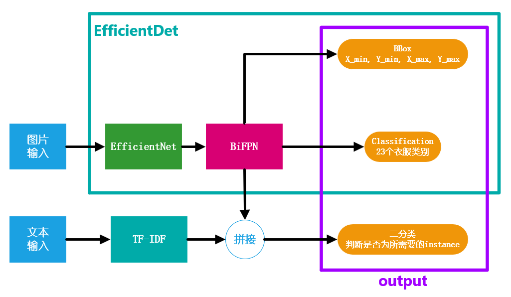
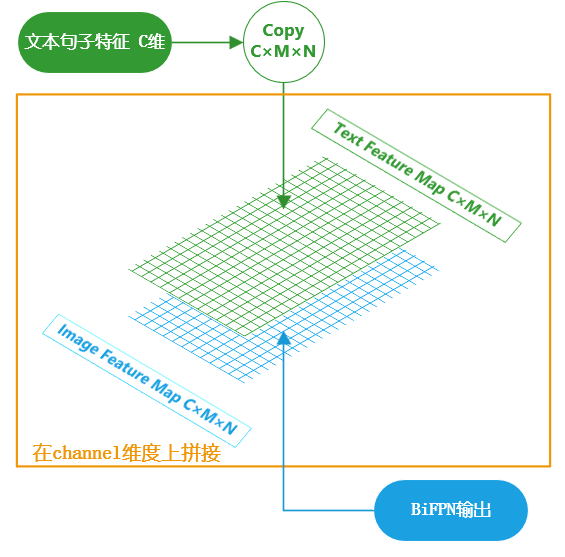
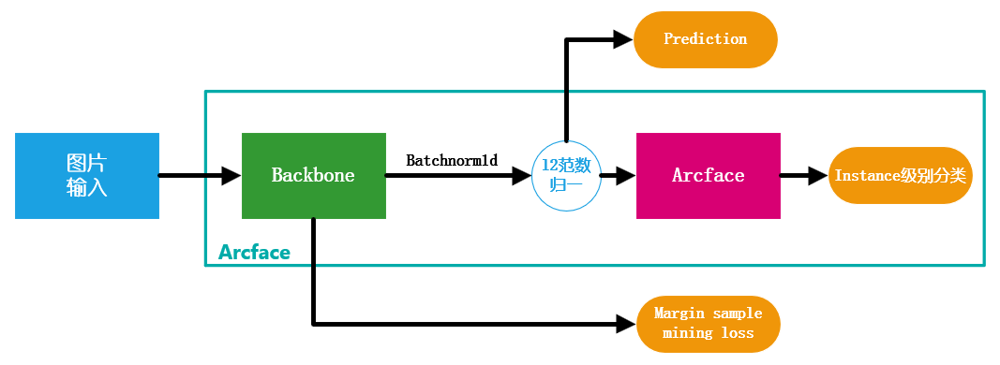
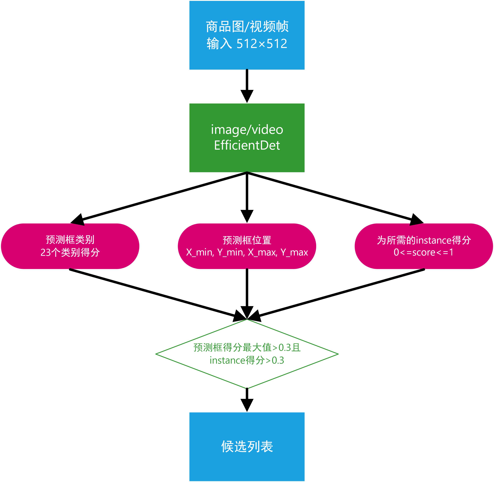
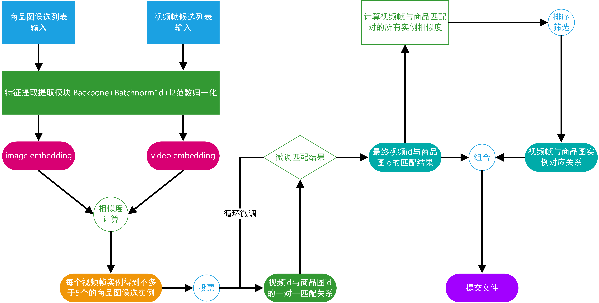

# 淘宝直播商品识别大赛

我们队伍采用的是两阶段方案：目标检测+匹配。

其中，目标检测阶段使用的原型是effiffifficientdet，匹配阶段使用的原型是arcface。代码可基于

python3.7和pytorch1.4运行。下面将详细介绍两阶段的方案。


## 技术方案说明

### 数据预处理

**相关文件**：process_data.py

**训练集数据处理**

* 相关方法：processImage，processVideo，processTrain，saveNumpyInstance
* 主要流程：
  * 使用processTrain，调用processImage处理所有训练集中的商品图信息，整合所有的图片的标注信息存到一个json（train_images_annonations.json）文件中，将所有的图片整合train_images文件夹；调用processVideo处理训练集中所有的商品图信息，整合所有的视频帧标注信息到一个json（train_videos_annonation.json）中，将所有含标注的视频帧提取出，整合到train_videos文件夹中。
  * 使用saveNumpyInstance，借助生成的图片及视频的标注文件，将train_images和train_videos中bbox提取成图片，整合到train_instances文件夹中，在此过程中筛选掉instance_id$\leq$0的实例

**验证集数据处理与测试集类似**

### 目标检测



我们在目标检测阶段使用的是[EfficientDet](https://arxiv.org/abs/1911.09070)，并考虑到商品图或视频有不少BBox的所框的目标不是该商品图或视频所要售卖的，会影响到后续的匹配精度。因此我们采用了TF-IDF（试验过BERT，效果不理想）提取句子体征并与BiFPN输出的image feature map拼接。拼接方式如下图所示：




在判断所选BBox是否为所需要的instance时，通过控制阈值在保证召回率的情况下，视频精确率为65%左右，商品图的精确度为85%左右，召回率均为95%左右。

我们使用原型为EfficientDet-d4作为提交模型。

目标检测模型在taobao/efficientdet中，训练代码为taobao/train_efficientdet.py，验证代码为taobao/validation_efficientdet.py

训练图片大小为512×512

### 匹配



在匹配阶段我们采用[Arcface](https://arxiv.org/abs/1801.07698)模型，在训练初期时，仅采用Intance级别分类损失（不采用[Margin sample mining loss](https://arxiv.org/abs/1710.00478)），考虑到Arcface难收敛，所以我们采用m=0.1, 0.3, 0.5, 0.7的方法分步训练。在收敛后加入Margin sample mining loss继续训练。在backbone选择方面，我们尝试了resnet，densenet, efficientnet, inception等流行模型，最终选择了[ResNeSt](https://arxiv.org/abs/2004.08955)和[CBAM](https://arxiv.org/abs/1807.06521)模型作为backbone。

目标检测模型在taobao/arcface中，训练代码为taobao/train_arcface.py，验证代码为taobao/validation_arcface.py

最终提交方案为ResNeSt50, ResNeSt101, CBAM101模型融合方案。

训练图片为在BBox扩充10%并resize到270×270，并随机crop出256×256作为输入图片

### 开源数据集

* [DeepFashion](http://mmlab.ie.cuhk.edu.hk/projects/DeepFashion.html)
* [DeepFashion2](https://arxiv.org/abs/1901.07973)

主要用途：微调匹配的backbone，使用deepfashion(2)数据集训练backbone后再使用比赛数据集训练模型，对deepfashion数据的处理同对训练集数据的处理一致。

### 文件目录结构

```shell
│  autoaugment.py
│  cal_score.py
│  config.py
│  dataset.py
│  process_data.py
│  README.md
│  train_arcface.py
│  train_efficientdet.py
│  train_hardtriplet.py
│  utils.py
│  validation_all.py
│  validation_arcface.py
│  validation_efficientdet.py
├─arcface
├─docker
└─efficientdet  
```

## 训练说明

### 简介

我们队伍采用两阶段方案：目标检测+匹配，故对检测和匹配的模型分开训练

训练检测模型的代码在taobao文件夹中，入口代码文件为taobao/train_efficientdet.py。本地验证过程代码为taobao/validation_efficientdet.py。

训练检测模型的代码在taobao文件夹中，入口代码文件为taobao/train_arcface.py。本地验证过程代码为taobao/validation_arcface.py。

### 目标检测


**相关文件及文件夹**：config.py、train_efficientdet.py、dataset.py、efficientdet

**训练过程**：入口文件在入taobao/train_efficientdet.py ，使用 EfficientdetDataset加载数据(加载训练集中每一张图片，对视频帧和图片的检测模型**分开训练**（通过修改config.py文件中efficientdet参数配置中的**imgORvdo**）；训练的过程通过修改config文件可修改训练过程相关参数;本地验证过程代码为validation_efficientdet.py

**加载数据集**：dataset.EfficientdetDataset

```python
    def __getitem__(self, index):
        imgPath, annotationsList, imgName, t = self.images[index]
        text_name = imgName.split('_')[0]
        text = self.textDic[t][text_name]
        text = torch.Tensor(text).long()

        img = cv2.imread(os.path.join(self.root_dir, imgPath))
        img = cv2.cvtColor(img, cv2.COLOR_BGR2RGB)
        img = img.astype(np.float32) / 255

        annotations = np.zeros((len(annotationsList), 6))
        for i, annotationDic in enumerate(annotationsList):
            annotation = np.zeros((1, 6))
            annotation[0, :4] = annotationDic['box']
            annotation[0, 4] = annotationDic['label']
            if annotationDic['instance_id'] > 0:
                annotation[0, 5] = 1
            else:
                annotation[0, 5] = 0
            annotations[i:i+1, :] = annotation
            
        sample = {'img': img, 'annot': annotations, 'text': text}
        if self.transform:
            sample = self.transform(sample)
        return sample
```

该过程提取视频帧或者商品图，提供相关图片的信息如box、box的label、box是否属于某个实例，图片的text等信息

**训练核心代码**：train_efficientdet.py

```python
    num_iter_per_epoch = len(training_generator)
    for epoch in range(opt.num_epochs):
        print('Epoch: {}/{}:'.format(epoch + 1, opt.num_epochs))
        model.train()
        epoch_loss = []
        acc = []
        progress_bar = tqdm(training_generator)
        for iter, data in enumerate(progress_bar):
            optimizer.zero_grad()
            ins_loss, cls_loss, reg_loss = model([
                data['img'].cuda().float(),
                data['text'].cuda(),
                data['annot'].cuda(), 
            ])
          

            ins_loss = ins_loss.mean()
            cls_loss = cls_loss.mean()
            reg_loss = reg_loss.mean()
            loss = cls_loss + reg_loss + ins_loss
            if loss == 0:
                continue
            loss.backward()
            optimizer.step()
            epoch_loss.append(float(loss))
            total_loss = np.mean(epoch_loss)

            progress_bar.set_description('Epoch: {}/{}. Iteration: {}/{}'.format(epoch + 1, opt.num_epochs, iter + 1, num_iter_per_epoch))
            progress_bar.write('Ins loss: {:.5f}\tCls loss: {:.5f}\tReg loss: {:.5f}\tBatch loss: {:.5f}\tTotal loss: {:.5f}'.format(
                    ins_loss, cls_loss, reg_loss, loss, total_loss))
        scheduler.step(np.mean(epoch_loss))

        if total_loss + opt.es_min_delta < best_loss:
            print('Saving model...')
            best_loss = total_loss
            best_epoch = epoch
            torch.save(model.module.state_dict(), os.path.join(opt.saved_path, opt.network+'_'+opt.imgORvdo+'.pth'))
```

该阶段训练代码，输入为图片以及相应的图片的信息（图片中的box，box的label，box是否为instance；图片的text等），将图片，图片text，以及图片中box信息输入网络，得到二分类的loss（判断box是否为instance），box类别分类loss，以及Bounding-Box regression的loss，将3个loss相加后反向传播，对网络进行训练。

### 匹配


**相关文件及文件夹**：config.py、train_arcface.py、dataset.py、arcface

**训练过程**：入口文件在taobao/train_arcface.py ，使用 ArcfaceDataset 加载数据(加载训练集中每一个instance的所有图片，包括视频帧和商品；训练的过程会采取randAugument 、randErasing，水平翻转等数据增强策略)，通过修改config文件可修改训练过程相关参数,本地验证过程代码为taobao/validaton_arcface.py

 **加载数据集**： dataset.ArcfaceDataset

```python
    def __getitem__(self, index):
        imgName, instance_id, textName, iORv, mode = self.images[index]
        img = np.load(imgName[:-4]+'.npy')
        # img = cv2.imread(imgName[:-4]+'.jpg')
        # img = cv2.cvtColor(img, cv2.COLOR_BGR2RGB)
        # img = img.astype(np.float32) / 255

        # '''randAug'''
        # img = Image.fromarray(np.uint8(img*255))
        # img = self.randAug(img)
        # img.save('aaa.jpg')
        # img = np.array(img)
        # img = img.astype(np.float32) / 255
        # '''randAug'''

        text = self.textDics[mode][iORv][textName]
        
        text = torch.tensor(text).long()
        iORv = torch.tensor(iORv).long()
        
        h, w, c = img.shape
        # print(h,w,c)
        rh = random.randint(0, h-256)
        rw = random.randint(0, w-256)

        img = img[rh:256+rh, rw:256+rw, :]

        img = cv2.resize(img, self.size)

        # '''random erasing'''
        # if np.random.rand() < 0.5:
        #     w = h = 256
        #     while w >= 256 or h >= 256:
        #         r = np.random.uniform(0.3, 1/0.3)
        #         s = 256*256*np.random.uniform(0.02, 0.4)
        #         w = int(np.sqrt(s*r))
        #         h = int(np.sqrt(s/r))
        #     s_w = random.randint(0, 256-w)
        #     s_h = random.randint(0, 256-h)
        #     img[s_h:s_h+h, s_w:s_w+w, :] = 0
        
        # print(img.shape)
        instance = torch.tensor(self.clsDic[str(instance_id)])
        label = torch.tensor(self.instance2label[str(instance_id)])

        if np.random.rand() < self.flip_x:
            img = img[:, ::-1, :].copy()
        img = torch.from_numpy(img)
        img = img.permute(2, 0, 1)
        
        img = self.transform(img)
        
        return {'img':img, 'instance':instance, 'label':label, 'text': text, 'iORv': iORv}
```

在过程中，对输入网络进行图片进行处理，如randAugument，randErasing，randCenterCrop等操作，输入图片的相关信息，如instance_id，label等

**训练核心代码**：train_arcface.py

```python
    for epoch in range(opt.num_epochs):
        print('Epoch: {}/{}:'.format(epoch + 1, opt.num_epochs))
        backbone.train()
        head.train()
        epoch_loss = []
        progress_bar = tqdm(training_generator)
        total = 0
        acc = 0
        acc_label = 0
        for iter, data in enumerate(progress_bar):
            optimizer.zero_grad()

            img = data['img'].cuda()
            # vdo = data['vdo'].cuda()
            instance = data['instance'].cuda()
            # text = data['text'].cuda()
            # iORv = data['iORv'].cuda()
            # label = data['label'].cuda()

            _, embedding = backbone(img)

            if opt.head == 'circleloss':
                loss, output = head([embedding, instance])
            else:
                output = head([embedding, instance])
                loss = cost(output, instance)

            total += instance.size(0)
            acc += (torch.argmax(output, dim=1)==instance).sum().float()

            loss_head = 0
            loss_all = loss
            loss_all.backward()
            optimizer.step()
            epoch_loss.append(float(loss))
            total_loss = np.mean(epoch_loss)

            progress_bar.set_description('Epoch: {}/{}. Iteration: {}/{}'.format(epoch + 1, opt.num_epochs, iter + 1, num_iter_per_epoch))
            
            progress_bar.write(
                'Batch loss: {:.5f}\tTotal loss: {:.5f}\tHead loss: {:.5f}\tAccuracy: {:.5f}'.format(
                loss, total_loss, loss_head, acc/total))

        scheduler.step(np.mean(epoch_loss))

        if total_loss < best_loss:
            print('Saving models...')
            best_loss = total_loss
            torch.save(backbone.module.state_dict(), os.path.join(opt.saved_path, b_name+'.pth'))
            torch.save(head.module.state_dict(), os.path.join(opt.saved_path, h_name+'.pth'))
```

该阶段训练代码，输入为图片以及相应的图片的instance_id，将图片输入backbone后获得相应的embedding，根据配置函数的设置可选择相应的损失函数对网络进行训练。

## 推理说明

### 简介

提交推理过程代码在taobao/docker文件夹中，入口代码文件为taobao/docker/test.py。

本地验证过程代码为taobao/validation_all.py。

其中taobao/validation_all.py与taobao/docker/test.py代码文件除了数据加载代码外其他完全一致。

推理过程分为目标检测阶段与匹配阶段。

### 目标检测阶段



**目标检测阶段核心代码taobao/docker/test.py**

```python
def pre_efficient(dataset, model, opt_e, cls_k, ins_f=True, calAREA=None):
    params = {"batch_size": opt_e.batch_size,
                    "shuffle": False,
                    "drop_last": False,
                    "collate_fn": collater_test,
                    "num_workers": opt_e.workers}
    loader = DataLoader(dataset, **params)
    progress_bar = tqdm(loader)
    items = []
    for i, data in enumerate(progress_bar):
        scale = data['scale']
        with torch.no_grad():
            output_list = model([data['img'].cuda().float(), data['text'].cuda()])
        for j, output in enumerate(output_list):
            imgPath, imgID, frame = dataset.getImageInfo(i*opt_e.batch_size+j)
            scores, labels, instances, all_labels, boxes = output
            if cls_k:
                argmax = np.argpartition(all_labels.cpu(), kth=-cls_k, axis=1)[:, 
                                                                               -cls_k:]
            else:
                argmax = -np.ones([len(all_labels), 1])
            boxes /= scale[j]
            area_arg = range(boxes.shape[0])
            if calAREA is not None:
                areas = area(boxes.cpu().numpy())
                area_arg = np.argsort(-areas)[:calAREA]
            for box_id in area_arg:
                if instances[box_id, 0] == 0 and ins_f and len(area_arg) > 1:
                    continue
                pred_prob = float(scores[box_id])
                if pred_prob < opt_e.cls_threshold:
                    break
                xmin, ymin, xmax, ymax = boxes[box_id, :]
                l = [frame, imgID, imgPath, int(xmin), int(ymin), int(xmax), int(ymax),
                     argmax[box_id].tolist(), data['text'][j]]
                items.append(l)
    return items
```

该阶段推理代码输入为商品图/视频帧的dataset，efficientdet配置信息以及一些参数，输出为候选列表，列表的每一项包含一个实例的图/帧编码，商品图/视频id，文件路径，预测框坐标，分类top cls_k，以及对应文本描述。作为下一阶段的输入。

### 匹配阶段



**匹配阶段核心代码taobao/docker/test.py**

```python
def pre_bockbone(dataset, models, opt_a):
    params = {"batch_size": opt_a.batch_size,
                "shuffle": False,
                "drop_last": False,
                "num_workers": opt_a.workers}
    
    generator = DataLoader(dataset, **params)

    length = len(dataset)
    features_arr = [np.zeros((length, opt_a.embedding_size)) for i in range(len(models))]
    boxes_arr = np.zeros((length, 4))
    IDs = []
    frames = []
    classes = []
    
    progress_bar = tqdm(generator)
    for i, data in enumerate(progress_bar):
        img = data['img'].cuda()
        imgID = data['imgID']
        frame = data['frame']
        box = data['box'].numpy()
        # text = data['text'].cuda()
        cs = [d.view(-1, 1) for d in data['classes']]
        cs = torch.cat(cs, dim=1).tolist()

        with torch.no_grad():
            for index, model in enumerate(models):
                features = model(img).cpu().numpy()
                features_arr[index][i*opt_a.batch_size:min((i+1)*opt_a.batch_size, 
                                                           length), :] = features
        classes += cs
        IDs += imgID
        frames += frame
        boxes_arr[i*opt_a.batch_size:min((i+1)*opt_a.batch_size, length), :] = box
       
    return features_arr, boxes_arr, IDs, frames, classes
```

输入为由候选列表形成的dataset，模型列表(可适用于多模型)以及匹配阶段的配置。输出为商品图/视频帧实例的特征向量以及对应的标注框位置、id、图片/帧编码和类别。作为匹配策略的输入，下面是匹配策略的核心代码，同样位于taobao/docker/test.py

```python
def createVdo2Img(imgs, vdos, k, opt_a):
    vdo2img = []
    config_list = opt_a.validation_config

    rates = []
    backbones = []
    for network, num_layers, r, add_info in config_list:
        opt_a.network = network
        opt_a.num_layers_c = num_layers
        opt_a.num_layers_r = num_layers
        opt_a.num_layers_s = num_layers
        rates.append(r)
        
        if opt_a.network == 'resnet_cbam':
            backbone = ResNetCBAM(opt_a)
            b_name = opt_a.network+'_{}'.format(opt_a.num_layers_c)
        elif opt_a.network == 'resnest':
            backbone = ResNeSt(opt_a)
            b_name = opt_a.network+'_{}'.format(opt_a.num_layers_s)
        else:
            raise RuntimeError('Cannot Find the Model: {}'.format(opt_a.network))

        backbone.load_state_dict(torch.load(os.path.join(opt_a.saved_path, 
                                                         b_name+'.pth'+add_info)))
        backbone.cuda()
        backbone.eval()

        backbones.append(backbone)

    dataset_det_img = TestDataset(opt_a.data_path, imgs, (opt_a.size, opt_a.size), 
                                  mode='image')
    dataset_det_vdo = TestDataset(opt_a.data_path, vdos, (opt_a.size, opt_a.size),
                                  mode='video')
    print('creating features...')
    img_features_list, img_boxes, img_IDs, img_frames, img_classes = pre_bockbone(dataset_det_img, backbones, opt_a)
    vdo_features_list, vdo_boxes, vdo_IDs, vdo_frames, vdo_classes = pre_bockbone(dataset_det_vdo, backbones, opt_a)
    
    length_v = vdo_features_list[0].shape[0] // 2
    length_i = img_features_list[0].shape[0] // 2
    # cos = np.zeros((length_v, length_i))
    print('calculating cosine similarity...')
    for index in tqdm(range(1+(length_v-1)//1000)):
        cos_1 = 0
        cos_2 = 0
        for i in range(len(img_features_list)):
            if index < length_v//1000:
                cos_1 += rates[i]*cosine_similarity(
                    vdo_features_list[i][1000*index:1000*(index+1)], 
                    img_features_list[i])
                cos_2 += rates[i]*cosine_similarity(
                    vdo_features_list[i][length_v+1000*index:length_v+1000*(index+1)],
                    img_features_list[i])     
            else:
                cos_1 += rates[i]*cosine_similarity(
                    vdo_features_list[i][1000*index:length_v], img_features_list[i])
                cos_2 += rates[i]*cosine_similarity(
                    vdo_features_list[i][length_v+1000*index:], img_features_list[i])

        cos = np.max((cos_1[:, :length_i], cos_1[:, length_i:], cos_2[:, :length_i], 
                      cos_2[:, length_i:]), axis=0)

        argmax = np.argpartition(cos, kth=-k, axis=1)[:, -k:]
        
        for i in range(argmax.shape[0]):
            max_cos = max(cos[i, argmax[i, :]])
            for am in argmax[i, :]:
                if cos[i, am] > 0:
                    vdo2img.append([vdo_IDs[i+1000*index], img_IDs[am], cos[i, am], 
                                    i+1000*index, am])

    return vdo2img, img_features_list, vdo_features_list, img_boxes[:length_i],
			vdo_boxes[:length_v], img_IDs[:length_i], vdo_IDs[:length_v],
    		img_frames[:length_i], vdo_frames[:length_v], img_classes[:length_i],					vdo_classes[:length_v]
```

该部分代码创建匹配阶段dataset和model列表，并输入pre_backbone。得到pre_backbone输出后计算余弦相似度，并排序得到每个视频帧实例对应的不多于k个的商品图实例。

并通过下列代码微调，代码位于taobao/docker/test.py

```python
vdo2img_d = {}
    print('merging videos...')
    for l in tqdm(vdo2img):
        if cls_k != 0:
            flag = False
            vdo_index = l[3]
            img_index = l[4]
            vdo_cls = vdo_classes[vdo_index]
            img_cls = img_classes[img_index]
            if len(set(vdo_cls) & set(img_cls)) == 0:
                continue
        if l[0] not in vdo2img_d:
            vdo2img_d[l[0]] = {}
        if l[1] not in vdo2img_d[l[0]]:
            vdo2img_d[l[0]][l[1]] = [l[2], l[2], l[3], l[4]]
        else:
            lst = vdo2img_d[l[0]][l[1]]
            if l[2] > lst[1]:
                lst[1] = l[2]
                lst[2] = l[3]
                lst[3] = l[4]
            lst[0] += l[2]
            vdo2img_d[l[0]][l[1]] = lst
    k = 1
    dic = {}
    out_imgs = set([])
    vdo2img_d_sorted = {}
    vdo2img_d_result = {}
    pre_imgs = set([])
    for vdo_k in vdo2img_d.keys():
        score_sum = 1e-8
        for img_k in vdo2img_d[vdo_k]:
            score_sum += vdo2img_d[vdo_k][img_k][0]
        for img_k in vdo2img_d[vdo_k]:
            vdo2img_d[vdo_k][img_k][0] /= score_sum
        vdo2img_d_sorted[vdo_k] = sorted(vdo2img_d[vdo_k].items(), key=lambda x:x[1][0], 
                                         reverse=True)
        vdo2img_d_result[vdo_k] = vdo2img_d_sorted[vdo_k][0]
        img_k = vdo2img_d_sorted[vdo_k][0][0]
        if img_k not in dic:
            d = {}
            d['img_index'] = vdo2img_d_sorted[vdo_k][0][1][3]
            d['vdos'] = []
            dic[img_k] = d
        d = {}
        d['vdo_id'] = vdo_k
        d['vdo_index'] = vdo2img_d_sorted[vdo_k][0][1][2]
        d['score'] = vdo2img_d_sorted[vdo_k][0][1][0]
        dic[img_k]['vdos'].append(d)
        if len(dic[img_k]['vdos']) >= k:
            out_imgs.add(img_k)
        pre_imgs.add(img_k)
   
    for _ in range(2):
        lst = []
        num = 0
        num_a = 0
        for key in dic.keys():
            lst.append(len(dic[key]['vdos']))
            if len(dic[key]['vdos']) <= k:
                continue
            l = sorted(dic[key]['vdos'], key=lambda x:x['score'], reverse=True)
            max_s = l[0]['score']
            l = l[k:]
            for d in l:
                if d['score'] > max_s-0.01:
                    continue
                vdo_k = d['vdo_id']
                img_k = key
                flag = False
                for index, item in enumerate(vdo2img_d_sorted[vdo_k]):
                    if item[0] == vdo2img_d_result[vdo_k][0]:
                        continue
                    if item[0] in out_imgs:
                        if item[0] in dic.keys():
                            max_score = sorted(
                                dic[item[0]]['vdos'], key=lambda x:x['score'], 
                                reverse=True)[0]['score']
                            if item[1][0] < max_score-0.01:
                                continue
                    pre_imgs.add(item[0])
                    vdo2img_d_result[vdo_k] = item
                    flag = True
                    break
                if flag == True:
                    vdo2img_d_sorted[vdo_k] = vdo2img_d_sorted[vdo_k][index:]
        dic = {}
        count_dic = {}
        for key in vdo2img_d_result.keys():
            item = vdo2img_d_result[key]
            if item[0] not in count_dic:
                count_dic[item[0]] = 0
            count_dic[item[0]] += 1
            if item[0] not in dic:
                d = {}
                d['img_index'] = item[1][3]
                d['vdos'] = []
                dic[item[0]] = d
            d = {}
            d['vdo_id'] = key
            d['vdo_index'] = item[1][2]
            d['score'] = item[1][0]
            dic[item[0]]['vdos'].append(d)
            if len(dic[item[0]]['vdos']) >= k:
                out_imgs.add(item[0])
```

微调策略为在得到视频实例和商品图实例的匹配后，计算每个商品图实例被多少个相同的视频实例匹配，并计算排序该商品图实例对多个同个视频实例的相似度，并筛选得分较高的匹配对，其余匹配对向下进行再匹配。并可以此循环一定次数。

通过上述匹配策略后得到最终的视频id与商品图id的匹配对，最后再计算每对匹配对的视频帧和商品图的所有实例的相似度，并通过排序和筛选得到若干个实例匹配对。若没有满足条件的实例匹配对，则删除该视频id与商品id的匹配对关系。最终将该实例匹配关系和id匹配关系组合成提交文档，核心代码如下，位置位于taobao/docker/test.py

```python
vdo_dic = {}
    for i in range(len(vdo_IDs)):
        if vdo_IDs[i] not in vdo_dic:
            vdo_dic[vdo_IDs[i]] = {}
        if vdo_frames[i] not in vdo_dic[vdo_IDs[i]]:
            vdo_dic[vdo_IDs[i]][vdo_frames[i]] = []
        vdo_dic[vdo_IDs[i]][vdo_frames[i]].append(i)
    
    img_dic = {}
    for i in range(len(img_IDs)):
        if img_IDs[i] not in img_dic:
            img_dic[img_IDs[i]] = []
        img_dic[img_IDs[i]].append(i)
    
    result = {}
    print('testing...')
    for k in tqdm(vdo2img_d_result.keys()):
        max_pre = vdo2img_d_result[k]
        vdo_id = vdo_IDs[max_pre[1][2]]
        img_id = img_IDs[max_pre[1][3]]
        frame_index = vdo_frames[max_pre[1][2]]
        vdo_index = vdo_dic[vdo_id][frame_index]
        img_index = img_dic[img_id]
        result[vdo_id] = {}
        result[vdo_id]['item_id'] = img_id
        result[vdo_id]['frame_index'] = int(frame_index)
        result[vdo_id]['result'] = []
        cos = 0
        for i in range(len(img_features_list)):
            vdo_f = np.zeros((0, opt_a.embedding_size))
            for index in vdo_index:
                vdo_f = np.append(vdo_f, vdo_features_list[i][index].reshape(1, opt_a.embedding_size), axis=0)
            img_f = np.zeros((0, opt_a.embedding_size))
            for index in img_index:
                img_f = np.append(img_f, img_features_list[i][index].reshape(1, opt_a.embedding_size), axis=0)
            cos += cosine_similarity(vdo_f, img_f)
        max_i = []
        for i, index in enumerate(vdo_index):
            simis = [cos[i, j] for j in range(len(img_index))]
            simis_is = np.argsort(-np.array(simis))
            for simis_i in simis_is:
                img_c = img_classes[img_index[simis_i]]
                vdo_c = vdo_classes[index]
                if len(set(vdo_c) & set(img_c)) == 0:
                    continue
                max_i.append((simis[simis_i], img_index[simis_i], index))
        if len(max_i) > 0:
            max_i = sorted(max_i, key=lambda x:x[0], reverse=True)
            max_sim = max_i[0][0]
            if max_sim > 0.33 * len(img_features_list):
                for sim, max_img_i, max_vdo_i in max_i:
                    if sim > max_sim - 0.15 * len(img_features_list):
                        d = {}
                        d['img_name'] = img_frames[max_img_i]
                        d['item_box'] = list(map(int, img_boxes[max_img_i].tolist()))
                        d['frame_box'] = list(map(int, vdo_boxes[max_vdo_i].tolist()))
                        result[vdo_id]['result'].append(d)
                    else:
                        break

        if len(result[vdo_id]['result']) == 0:
            del result[vdo_id]

    with open('result.json', 'w') as f:
        json.dump(result, f)
```

## 队长联系方式

**林德铝**

**手机：17681716901（同微信）**


